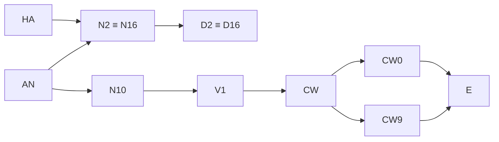

<!-- Draft produced 2026-09-02 by a ChatGPT Pro run against snapshot ff342e0 and reviewed by Claude; status: draft pending independent audit (Pro job target-specification-audit). Once audited this file is the normative Target Specification the bounty and the paper refer to. -->

---
title: "Target Specification v1.0"
subtitle: 'Decimal disjunctivity and adjacent digit-distribution nodes for π'
version: "1.0"
status_cutoff: "2026-09-02"
repository: "thepok/PI"
repository_snapshot: "ff342e0fbedec5f37decdaeea88ca2f6853320c9"
normative_lean_node: "Theory.PiDigits.V1"
---

# Target Specification v1.0

**Status cutoff:** 2026-09-02.  
**Normative repository snapshot:** [`thepok/PI@ff342e0`](https://github.com/thepok/PI/tree/ff342e0fbedec5f37decdaeea88ca2f6853320c9).  
**Normative V1 source:** [`TheoryLib/PiDigits/T7Statements.lean`](https://github.com/thepok/PI/blob/ff342e0fbedec5f37decdaeea88ca2f6853320c9/TheoryLib/PiDigits/T7Statements.lean).  
**Research-map source:** [`FRONTIER.md`](https://github.com/thepok/PI/blob/ff342e0fbedec5f37decdaeea88ca2f6853320c9/FRONTIER.md) and [`TARGET.md`](https://github.com/thepok/PI/blob/ff342e0fbedec5f37decdaeea88ca2f6853320c9/knowledge/pi/workstreams/TARGET.md).

This document fixes the propositions to be adjudicated. Except for **HA**, every node is a proposition about \(\pi\). The cited mathematical theorems are sourced to original papers.

---

## 1. Conventions

### 1.1 Sets and elementary notation

\[
\mathbb N_0:=\{0,1,2,\ldots\},\qquad
\mathbb N_+:=\{1,2,3,\ldots\},\qquad
A_b:=\{0,1,\ldots,b-1\}.
\]

For \(y\in\mathbb R\),

\[
\{y\}:=y-\lfloor y\rfloor\in[0,1),\qquad
\|y\|_{\mathbb R/\mathbb Z}:=\min_{m\in\mathbb Z}|y-m|.
\]

A word of length \(k\) over \(A_b\) is a function \(w:\{0,\ldots,k-1\}\to A_b\), equivalently an element of \(A_b^k\). Leading zeroes are significant. Two occurrences may overlap.

### 1.2 Canonical base-\(b\) expansion

For \(b\ge2\), use the unique expansion not eventually equal to \(b-1\):

\[
\{\alpha\}=\sum_{n=0}^{\infty}d_n^{(b)}(\alpha)b^{-(n+1)},\qquad
d_n^{(b)}(\alpha)
=\big\lfloor b^{n+1}\{\alpha\}\big\rfloor
-b\big\lfloor b^n\{\alpha\}\big\rfloor\in A_b.
\]

Thus a terminating expansion is represented with trailing zeroes, not trailing \(b-1\)'s. Since \(\pi\) is irrational [Niv47], its expansion is nonterminating and has no dual-expansion ambiguity in any integer base.

For decimal digits of \(\pi\), write

\[
d_n:=d_n^{(10)}(\pi)
=\big\lfloor 10^{n+1}\pi\big\rfloor\bmod 10.
\]

The Lean definition is

```lean
noncomputable def piDigit (n : ℕ) : Fin 10 :=
  ⟨⌊Real.pi * (10 : ℝ) ^ (n + 1)⌋₊ % 10, Nat.mod_lt _ (by norm_num)⟩
```

and therefore

\[
\operatorname{piDigit}(0)=1,\quad
\operatorname{piDigit}(1)=4,\quad\ldots
\]

The indexing is **zero-based after the decimal point**. The integer part \(3\) is not an indexed digit and has no position in this stream.

### 1.3 Occurrences and frequencies

For \(w\in A_b^k\), define the occurrence count by starting positions

\[
C_b(w,N;\alpha):=
\#\Bigl\{n\in\mathbb N_0:
n<N\ \land\
(\forall i\in\mathbb N_0)(i<k\Rightarrow d_{n+i}^{(b)}(\alpha)=w_i)
\Bigr\}.
\]

Occurrences are allowed to overlap. The convention counts every start \(n<N\), even when the window extends past digit \(N-1\). Requiring the window to lie wholly inside the first \(N\) digits changes the count by at most \(k-1\) and therefore gives the same limiting frequencies.

The empty word is the unique member of \(A_b^0\). Its occurrence condition is vacuous. V1 and the disjunctivity nodes below include it to match the Lean quantifiers; the constant-word nodes start at \(k=1\).

### 1.4 The decimal shift orbit

Set

\[
x_n:=\{10^n\pi\}\qquad(n\in\mathbb N_0).
\]

Then

\[
x_n=\sum_{j=0}^{\infty}d_{n+j}10^{-(j+1)},\qquad
d_n=\lfloor10x_n\rfloor,\qquad
x_{n+1}=10x_n-d_n.
\]

For \(k\ge1\),

\[
d_n\cdots d_{n+k-1}=0^k
\iff 0\le x_n<10^{-k},
\]

\[
d_n\cdots d_{n+k-1}=9^k
\iff 1-10^{-k}\le x_n<1.
\]

These are the decimal cylinder identities used below.

---

## 2. Node definitions

### 2.1 Simple normality versus normality

Simple normality in base \(b\) means only correct one-digit frequencies:

\[
\operatorname{SN}_b(\alpha)
:\Longleftrightarrow
(\forall a\in A_b)\quad
\lim_{N\to\infty}\frac{C_b((a),N;\alpha)}{N}=\frac1b.
\]

Normality in base \(b\) means correct frequency for every finite block:

\[
\operatorname{N}_b(\alpha)
:\Longleftrightarrow
(\forall k\in\mathbb N_+)(\forall w\in A_b^k)\quad
\lim_{N\to\infty}\frac{C_b(w,N;\alpha)}{N}=b^{-k}.
\]

Hence \(\operatorname N_b(\alpha)\Rightarrow\operatorname{SN}_b(\alpha)\); the converse is false. No node below uses “normal” to mean merely simple normality.

### 2.2 Constant-word nodes

#### CW0

\[
\boxed{\displaystyle
\mathrm{CW0}
:\Longleftrightarrow
(\forall k\in\mathbb N_+)(\exists n\in\mathbb N_0)
(\forall i\in\mathbb N_0)\,
\bigl(i<k\Rightarrow d_{n+i}=0\bigr).}
\]

#### CW9

\[
\boxed{\displaystyle
\mathrm{CW9}
:\Longleftrightarrow
(\forall k\in\mathbb N_+)(\exists n\in\mathbb N_0)
(\forall i\in\mathbb N_0)\,
\bigl(i<k\Rightarrow d_{n+i}=9\bigr).}
\]

#### CW

\[
\boxed{\displaystyle
\mathrm{CW}
:\Longleftrightarrow
\left[
(\forall k\in\mathbb N_+)(\exists n\in\mathbb N_0)
(\forall i\in\mathbb N_0)\,(i<k\Rightarrow d_{n+i}=0)
\right]
\land
\left[
(\forall k\in\mathbb N_+)(\exists n\in\mathbb N_0)
(\forall i\in\mathbb N_0)\,(i<k\Rightarrow d_{n+i}=9)
\right].}
\]

Thus CW is the conjunction, not the disjunction, of the two directed endpoint properties.

### 2.3 Decimal nodes

#### V1 — decimal disjunctivity

\[
\boxed{\displaystyle
\mathrm{V1}
:\Longleftrightarrow
(\forall k\in\mathbb N_0)(\forall w\in A_{10}^k)
(\exists n\in\mathbb N_0)(\forall i\in\mathbb N_0)\,
\bigl(i<k\Rightarrow d_{n+i}=w_i\bigr).}
\]

This is exactly `Theory.PiDigits.V1` after identifying `List (Fin 10)` with finite words over \(A_{10}\). In Lean:

```lean
def V1 : Prop :=
  ∀ s : List (Fin 10), ∃ n : ℕ, ∀ i : ℕ, ∀ hi : i < s.length,
    piDigit (n + i) = s.get ⟨i, hi⟩
```

The node asks for at least one occurrence. It nevertheless implies infinitely many occurrences of each fixed word: apply V1 to \(0^M w\), which places an occurrence of \(w\) at a start at least \(M\).

#### N10 — decimal normality

\[
\boxed{\displaystyle
\mathrm{N10}
:\Longleftrightarrow
(\forall k\in\mathbb N_+)(\forall w\in A_{10}^k)\quad
\lim_{N\to\infty}\frac{C_{10}(w,N;\pi)}{N}=10^{-k}.}
\]

### 2.4 Binary and hexadecimal nodes

#### D2 — base-2 disjunctivity

\[
\boxed{\displaystyle
\mathrm{D2}
:\Longleftrightarrow
(\forall k\in\mathbb N_0)(\forall w\in A_2^k)
(\exists n\in\mathbb N_0)(\forall i\in\mathbb N_0)\,
\bigl(i<k\Rightarrow d_{n+i}^{(2)}(\pi)=w_i\bigr).}
\]

#### N2 — base-2 normality

\[
\boxed{\displaystyle
\mathrm{N2}
:\Longleftrightarrow
(\forall k\in\mathbb N_+)(\forall w\in A_2^k)\quad
\lim_{N\to\infty}\frac{C_2(w,N;\pi)}{N}=2^{-k}.}
\]

#### D16 — base-16 disjunctivity

\[
\boxed{\displaystyle
\mathrm{D16}
:\Longleftrightarrow
(\forall k\in\mathbb N_0)(\forall w\in A_{16}^k)
(\exists n\in\mathbb N_0)(\forall i\in\mathbb N_0)\,
\bigl(i<k\Rightarrow d_{n+i}^{(16)}(\pi)=w_i\bigr).}
\]

#### N16 — base-16 normality

\[
\boxed{\displaystyle
\mathrm{N16}
:\Longleftrightarrow
(\forall k\in\mathbb N_+)(\forall w\in A_{16}^k)\quad
\lim_{N\to\infty}\frac{C_{16}(w,N;\pi)}{N}=16^{-k}.}
\]

### 2.5 Absolute normality

#### AN

\[
\boxed{\displaystyle
\mathrm{AN}
:\Longleftrightarrow
(\forall b\in\mathbb N_+)
\left[
b\ge2\Rightarrow
(\forall k\in\mathbb N_+)(\forall w\in A_b^k)\quad
\lim_{N\to\infty}\frac{C_b(w,N;\pi)}{N}=b^{-k}
\right].}
\]

### 2.6 Bailey–Crandall Hypothesis A

For a sequence \(z=(z_n)_{n\ge0}\subset[0,1)\), define

\[
\operatorname{FA}(z)
:\Longleftrightarrow
(\exists P\in\mathbb N_+)(\exists w_0,\ldots,w_{P-1}\in[0,1))
(\forall\varepsilon>0)(\exists K\in\mathbb N_0)
(\forall k\in\mathbb N_0)(\exists j<P)\quad
\|z_{K+k}-w_j\|_{\mathbb R/\mathbb Z}<\varepsilon.
\]

This is Bailey–Crandall’s exact finite-attractor quantifier pattern [BC01, Def. 2.5]. The selected index \(j\) may depend arbitrarily on \(k\); no cyclic order, period, or minimality is part of the definition.

Define equidistribution by

\[
\operatorname{UD}(z)
:\Longleftrightarrow
(\forall a,c\in\mathbb R)
\left[
0\le a<c<1\Rightarrow
\lim_{N\to\infty}
\frac{\#\{0\le n<N:z_n\in[a,c)\}}{N}=c-a
\right].
\]

#### HA

\[
\boxed{\displaystyle
\begin{aligned}
\mathrm{HA}:\Longleftrightarrow\
(\forall b\in\mathbb N_+)(\forall p,q\in\mathbb Z[X])\ 
&\Bigl[
b\ge2\ \land\ 0\le\deg p<\deg q\
\land\ (\forall n\in\mathbb N_+)\ q(n)\ne0
\Bigr]\\[-1mm]
&\Rightarrow
\Bigl[
\operatorname{FA}(z^{b,p,q})\ \lor\
\operatorname{UD}(z^{b,p,q})
\Bigr],
\\[-1mm]
&z^{b,p,q}_0=0,\qquad
z^{b,p,q}_n=
\left\{b z^{b,p,q}_{n-1}+\frac{p(n)}{q(n)}\right\}
\quad(n\in\mathbb N_+).
\end{aligned}}
\]

The exact concluding clause in [BC01, Hypothesis A] is: “either has a finite attractor or is equidistributed in \([0,1)\).” The degree condition excludes the zero polynomial \(p\), exactly as the printed condition \(0\le\deg p<\deg q\) does. No coprimality condition on \(p,q\) is added.

HA is a global assertion about every recurrence in this class; it is not itself a digit property of \(\pi\).

### 2.7 Endpoint node

#### E

\[
\boxed{\displaystyle
\mathrm{E}
:\Longleftrightarrow
\liminf_{n\to\infty}\|10^n\pi\|_{\mathbb R/\mathbb Z}=0
\quad\Longleftrightarrow\quad
(\forall\varepsilon>0)(\forall N\in\mathbb N_0)
(\exists n\in\mathbb N_0)\,
\bigl(n\ge N\land\|10^n\pi\|_{\mathbb R/\mathbb Z}<\varepsilon\bigr).}
\]

### 2.8 Exact base-power equivalences

Schmidt’s Theorem 1A [Sch60] states that if integer bases \(r,s\ge2\) are multiplicatively dependent,

\[
r\sim s
:\Longleftrightarrow
(\exists m,n\in\mathbb N_+)\ r^m=s^n,
\]

then a real number is normal to base \(r\) if and only if it is normal to base \(s\). Hence, for every \(b\ge2\), \(k\ge1\), and real \(\alpha\),

\[
\boxed{\operatorname N_b(\alpha)\Longleftrightarrow
\operatorname N_{b^k}(\alpha).}
\]

In particular,

\[
\boxed{\mathrm{N2}\Longleftrightarrow\mathrm{N16}.}
\]

Disjunctivity has the same base-power invariance:

\[
\boxed{\operatorname D_b(\alpha)\Longleftrightarrow
\operatorname D_{b^k}(\alpha),\qquad
\mathrm{D2}\Longleftrightarrow\mathrm{D16}.}
\]

**Proof.** Put \(B=b^k\). Canonical base-\(B\) digits are the aligned blocks of \(k\) canonical base-\(b\) digits.

If \(\alpha\) is \(B\)-disjunctive, extend any base-\(b\) word on the right to a length divisible by \(k\), encode the result as a base-\(B\) word, and use its aligned occurrence.

Conversely, let a target base-\(B\) word unpack to a base-\(b\) word \(u\) of length \(L\), where \(k\mid L\). Fix any \(a\in A_b\) and form a word containing \(k\) copies,

\[
u\,a\,u\,a\,\cdots\,a\,u.
\]

The \(j\)-th copy begins at relative offset \(j(L+1)\equiv j\pmod k\). At any occurrence of the enlarged word, exactly one copy of \(u\) therefore begins at an absolute position divisible by \(k\). That aligned copy is the required base-\(B\) occurrence. \(\square\)

### 2.9 Endpoint theorem

\[
\boxed{\mathrm{CW0}\Longleftrightarrow\liminf_{n\to\infty}x_n=0,\qquad
\mathrm{CW9}\Longleftrightarrow\limsup_{n\to\infty}x_n=1.}
\]

**Proof.** The cylinder identities in §1.4 give the pointwise equivalences. Starts of arbitrarily long constant blocks must be unbounded: otherwise one fixed tail would be all zeroes or all nines; either possibility contradicts the irrationality and canonical expansion of \(\pi\). The limit statements follow, and their converses are immediate from the same cylinders. \(\square\)

Since

\[
\|10^n\pi\|_{\mathbb R/\mathbb Z}=\min(x_n,1-x_n),
\]

a subsequence approaching either endpoint proves E. Conversely, E supplies a subsequence on which this minimum tends to zero; one of the two endpoint alternatives occurs infinitely often. Therefore

\[
\boxed{\mathrm{E}\Longleftrightarrow
\bigl(\mathrm{CW0}\lor\mathrm{CW9}\bigr).}
\]

E does not select a side and does not imply CW.

### 2.10 Exact chain \(\mathrm{HA}\Rightarrow\mathrm{N2}\)

The BBP identity is [BBP97, Eq. (1.2)]

\[
\pi=
\sum_{m=0}^{\infty}\frac1{16^m}
\left(
\frac4{8m+1}
-\frac2{8m+4}
-\frac1{8m+5}
-\frac1{8m+6}
\right).
\]

Bailey–Crandall rewrite it as [BC01, Eq. (7)]

\[
\pi=R(16,f),\qquad
f(m)=
\frac{47+151m+120m^2}
{15+194m+712m^2+1024m^3+512m^4}.
\]

Their \(R\)-to-\(R_0\) shift gives

\[
\alpha:=\frac{\pi}{16}
=\sum_{n=1}^{\infty}\frac1{16^n}
\frac{120n^2-89n+16}
{512n^4-1024n^3+712n^2-206n+21}.
\]

The associated recurrence is [BC01, Eq. (3)]

\[
z_0=0,\qquad
z_n=
\left\{
16z_{n-1}
+
\frac{120n^2-89n+16}
{512n^4-1024n^3+712n^2-206n+21}
\right\}.
\]

The denominator is positive for every \(n\ge1\), because after putting \(m=n-1\) it equals

\[
15+194m+712m^2+1024m^3+512m^4.
\]

The exact implication chain is:

1. [BC01, Thm. 3.1] proves that the recurrence has a finite attractor if and only if \(\alpha\) is rational. Its proof also gives
   \[
   \{16^n\alpha\}=\{z_n+t_n\},\qquad t_n\to0.
   \]
2. \(\pi\) is irrational [Niv47], hence \(\alpha=\pi/16\) is irrational. The finite-attractor branch is therefore excluded unconditionally.
3. HA forces the remaining branch: \((z_n)\) is equidistributed.
4. [BC01, Thm. 2.1] transfers equidistribution across the vanishing perturbation \(t_n\).
5. [BC01, Thm. 2.2] identifies equidistribution of \((\{16^n\alpha\})\) with base-16 normality of \(\alpha\).
6. [BC01, Thm. 2.4] preserves base-16 normality under multiplication by the nonzero rational \(16\), so \(\pi\) is base-16 normal.
7. [Sch60, Thm. 1A] gives base-16 normality if and only if base-2 normality.

Thus

\[
\boxed{\mathrm{HA}\Longrightarrow\mathrm{N16}
\Longleftrightarrow\mathrm{N2}.}
\]

Bailey–Crandall record the final conditional conclusion directly as [BC01, Thm. 1.1].

Lagarias [Lag01, Thm. 3.3] strengthens the unconditional exclusion: for the associated perturbed orbit, having only finitely many limit points is equivalent to rationality of the represented number. Hence the \(\pi/16\) recurrence has infinitely many limit points. This does not imply density or equidistribution.

---

## 3. Implication DAG

### 3.1 Meaning of an arrow

For the numerical nodes, an arrow \(P\to Q\) means a theorem valid for the corresponding properties of every real number, then specialized to \(\pi\). A counterexample number refutes such a structural implication.

HA is different in type: it is a single global recurrence hypothesis. An HA-related question mark below means that no substantive theorem deriving the target from the source is known. It is not a claim about the truth value of a material implication between two currently undecided propositions.

### 3.2 Quotient DAG

The pairs \(\mathrm{N2}\leftrightarrow\mathrm{N16}\) and
\(\mathrm{D2}\leftrightarrow\mathrm{D16}\) are collapsed so that the drawing is acyclic.



No transitive edge is drawn.

### 3.3 Complete ordered-pair matrix

Legend:

- `=`: identical node.
- `✓`: unconditional implication; the complete proof closure is in §3.4.
- `×W`: no structural implication; witness `W` in §3.5 satisfies the row node and fails the column node.
- `?`: no implication theorem known; every such cell has HA as source or target, so a number-class counterexample is not type-correct.

| source \(\Rightarrow\) target | CW0 | CW9 | CW | V1 | N10 | D2 | N2 | D16 | N16 | AN | HA | E |
|---|---:|---:|---:|---:|---:|---:|---:|---:|---:|---:|---:|---:|
| **CW0** | = | ×Z0 | ×Z0 | ×Z0 | ×Z0 | ×X10 | ×X10 | ×X10 | ×X10 | ×Z0 | ? | ✓ |
| **CW9** | ×Z9 | = | ×Z9 | ×Z9 | ×Z9 | ×X10 | ×X10 | ×X10 | ×X10 | ×Z9 | ? | ✓ |
| **CW** | ✓ | ✓ | = | ×Z09 | ×Z09 | ×X10 | ×X10 | ×X10 | ×X10 | ×Z09 | ? | ✓ |
| **V1** | ✓ | ✓ | ✓ | = | ×DV | ×X10 | ×X10 | ×X10 | ×X10 | ×DV | ? | ✓ |
| **N10** | ✓ | ✓ | ✓ | ✓ | = | ×X10 | ×X10 | ×X10 | ×X10 | ×X10 | ? | ✓ |
| **D2** | ×X2 | ×X2 | ×X2 | ×X2 | ×X2 | = | ×DB | ✓ | ×DB | ×DB | ? | ×X2 |
| **N2** | ×X2 | ×X2 | ×X2 | ×X2 | ×X2 | ✓ | = | ✓ | ✓ | ×X2 | ? | ×X2 |
| **D16** | ×X2 | ×X2 | ×X2 | ×X2 | ×X2 | ✓ | ×DB | = | ×DB | ×DB | ? | ×X2 |
| **N16** | ×X2 | ×X2 | ×X2 | ×X2 | ×X2 | ✓ | ✓ | ✓ | = | ×X2 | ? | ×X2 |
| **AN** | ✓ | ✓ | ✓ | ✓ | ✓ | ✓ | ✓ | ✓ | ✓ | = | ? | ✓ |
| **HA** | ? | ? | ? | ? | ? | ✓ | ✓ | ✓ | ✓ | ? | = | ? |
| **E** | ×Z9 | ×Z0 | ×Z0 | ×Z0 | ×Z0 | ×X10 | ×X10 | ×X10 | ×X10 | ×Z0 | ? | = |

### 3.4 Complete proof closure for every `✓`

The following implications, together with transitivity and identity, generate every `✓` in the matrix.

| Source | All nonidentity targets proved | Complete reason |
|---|---|---|
| CW0 | E | Endpoint theorem: CW0 implies the left alternative in \(E\iff(\mathrm{CW0}\lor\mathrm{CW9})\). |
| CW9 | E | Endpoint theorem: CW9 implies the right alternative. |
| CW | CW0, CW9, E | Definition of conjunction; then either endpoint gives E. |
| V1 | CW, CW0, CW9, E | Apply V1 to \(0^k\) and \(9^k\); then use the preceding row. |
| N10 | V1, CW, CW0, CW9, E | Each word has limiting frequency \(10^{-k}>0\), hence occurs; then use the preceding rows. |
| D2 | D16 | Base-power disjunctivity theorem in §2.8. |
| D16 | D2 | Same theorem, reverse direction. |
| N2 | N16, D2, D16 | Schmidt base-power theorem; normality implies positive frequency, hence disjunctivity. |
| N16 | N2, D16, D2 | Same arguments in the reverse base direction. |
| AN | Every numerical node | Use bases \(10,2,16\), normality \(\Rightarrow\) disjunctivity, and the decimal chain. |
| HA | N2, N16, D2, D16 | Exact BBP–Bailey–Crandall chain in §2.10, then normality \(\Rightarrow\) disjunctivity. |
| E | none | E is only the disjunction of the two directed endpoint properties. |

Normality implies disjunctivity because a word of length \(k\) has limiting occurrence frequency \(b^{-k}>0\); a sequence with no occurrence would have frequency zero.

All `?` cells are now exhausted: no theorem is known from any one \(\pi\)-digit node to the global HA statement, and no consequence of HA beyond the four binary/hexadecimal nodes above is known for \(\pi\).

### 3.5 Counterexample witnesses for every `×`

All displayed digit strings below are canonical and non-eventually periodic, hence irrational.

#### Z0 — CW0 without CW9

Let the decimal expansion be the concatenation

\[
Z0:=0.(1\,0^1)(1\,0^2)(1\,0^3)\cdots.
\]

It has arbitrarily long zero runs and no digit \(9\). Thus it satisfies CW0 and E, but fails CW9, CW, V1, N10, and AN.

#### Z9 — CW9 without CW0

Let

\[
Z9:=0.(8\,9^1)(8\,9^2)(8\,9^3)\cdots.
\]

It has arbitrarily long nine runs and no digit \(0\). Thus it satisfies CW9 and E, but fails CW0, CW, V1, N10, and AN.

#### Z09 — both constant-word families without disjunctivity

Let

\[
Z09:=0.(1\,0^1\,1\,9^1)(1\,0^2\,1\,9^2)
(1\,0^3\,1\,9^3)\cdots.
\]

It satisfies CW0 and CW9, hence CW and E, but digit \(2\) never occurs. Therefore it fails V1, N10, and AN.

#### DV — disjunctive but not normal in base 10

Enumerate all nonempty decimal words as \(u_1,u_2,\ldots\). Choose zero-block lengths \(L_m\) recursively and concatenate

\[
DV:=0.u_1\,0^{L_1}u_2\,0^{L_2}u_3\,0^{L_3}\cdots
\]

so that after stage \(m\), both the proportion of nonzero digits and the ratio
\(|u_{m+1}|/\text{(current length)}\) are below \(1/m\). Such an \(L_m\) always exists. Every finite word occurs as some \(u_m\), so DV is decimal-disjunctive. At every sufficiently long prefix the nonzero proportion tends to \(0\), hence the zero frequency tends to \(1\), not \(1/10\). DV is not even simply normal, so it fails N10 and AN.

#### DB — disjunctive but not normal in base 2

Repeat the DV construction over the binary alphabet. Every binary word occurs, while the zero frequency tends to \(1\). Hence DB satisfies D2 and, by §2.8, D16, but fails N2, N16, and AN.

#### X10 — decimal-normal but not binary-disjunctive

For \(1<t<s\), Schmidt [Sch60, Thm. 2] defines \(T_{s,t}\) by taking a canonical base-\(t\) digit stream \((\varepsilon_j)\) and interpreting the same digits in base \(s\):

\[
T_{s,t}\!\left(\sum_{j\ge1}\varepsilon_jt^{-j}\right)
:=\sum_{j\ge1}\varepsilon_js^{-j}.
\]

If \(r\not\sim s\), then for Lebesgue-almost every source number,
\(T_{s,t}\) is normal to base \(r\), while its base-\(s\) digits lie in
\(\{0,\ldots,t-1\}\), so it is not even simply normal to base \(s\).

Take \(r=10,s=4,t=2\). Choose a source in the full-measure set and put

\[
X10:=T_{4,2}(\xi).
\]

Then X10 is base-10 normal. Its base-4 digits are only \(0,1\); unpacked in base 2, every aligned pair is \(00\) or \(01\). The binary word \(11\) never occurs, even across pair boundaries. Therefore X10 fails D2, N2, D16, N16, and AN, while N10 gives V1, CW, CW0, CW9, and E.

#### X2 — binary-normal with no decimal endpoint recurrence

Schmidt’s theorem with \(r=2,s=10,t=2\) gives, for almost every source \(\xi\),

\[
y:=T_{10,2}(\xi)=\sum_{j\ge1}\varepsilon_j10^{-j}
\]

normal to base \(2\), with every decimal digit \(\varepsilon_j\in\{0,1\}\).
Set

\[
X2:=y+\frac19
=\sum_{j\ge1}(\varepsilon_j+1)10^{-j}.
\]

There is no carry, so every decimal digit of X2 is \(1\) or \(2\). Hence, for every \(n\),

\[
\frac19\le\{10^nX2\}\le\frac29,
\]

and X2 fails CW0, CW9, CW, V1, N10, and E.

It remains base-2 normal. More generally, if \(\alpha\) is normal in base \(b\) and \(q\in\mathbb Q\), then \(\alpha+q\) is normal in base \(b\): the sequence \(\{b^nq\}\) is eventually periodic, say with period \(P\); Schmidt’s base-power theorem gives normality of \(\alpha\) in base \(b^P\); multiplying by \(b^r\) preserves that normality [BC01, Thm. 2.4], so each residue-class subsequence \(\{b^{Pm+r}\alpha\}\) is equidistributed; adding its fixed periodic phase preserves equidistribution, and interleaving the \(P\) residue classes preserves it. Thus X2 satisfies N2, N16, D2, and D16, but not AN.

The unshifted number \(y\) already supplies the requested direct class **D2 without V1**.

### 3.6 Exact classical base-separation theorems

These results are recorded to prevent incorrect cross-base arrows.

1. **Cassels 1959.** Let \(U\) be the ternary Cantor set whose ternary digits are restricted to \(0,1\), with its natural Bernoulli measure. Cassels proves that for every integer \(b\ge2\) that is not a power of \(3\), almost every \(\xi\in U\) is normal to base \(b\) [Cas59, Theorem; Lemma 1]. His opening gloss of “normal” mentions one-digit frequencies, but the proof establishes uniform distribution of \((b^n\xi)\) modulo \(1\), which is full modern normality by the orbit criterion [BC01, Thm. 2.2]. Such numbers are normal to bases \(2\) and \(10\), but not to base \(3\). Cassels alone does **not** give N2 without N10.

2. **Schmidt 1960.** [Sch60, Thm. 1A] proves equivalence of normality for multiplicatively dependent bases. [Sch60, Thm. 1B] proves that if \(r\not\sim s\), there are continuum many numbers normal to base \(r\) but not even simply normal to base \(s\), and conversely. Taking \(r=2,s=10\) gives numbers N2 but not N10. [Sch60, Thm. 2] gives the explicit \(T_{s,t}\) full-measure construction used above.

3. **Schmidt 1962.** In modern notation, the main theorem of [Sch62] says: if \(\mathcal B\subseteq\{2,3,\ldots\}\) is closed under multiplicative dependence, then there exists a real number normal to every base in \(\mathcal B\) and nonnormal to every integer base outside \(\mathcal B\). Choosing \(\mathcal B\) as the multiplicative-dependence class of \(2\) again gives N2 without N10.

Bases \(2\) and \(10\) are multiplicatively independent because \(2^m=10^n\) has no solution \(m,n\in\mathbb N_+\).

---

## 4. Resolution criteria

### 4.1 What resolves a node

A node is resolved only by an unconditional proof or an unconditional disproof of the exact displayed proposition in §2, in an accepted foundational system.

- **Proof:** establishes every displayed universal quantifier.
- **Disproof of CW0 or CW9:** proves that some explicit length \(k\ge1\) never occurs on the specified side.
- **Disproof of CW:** disproves at least one of CW0 or CW9.
- **Disproof of a disjunctivity node:** gives a finite word and proves that it has no occurrence.
- **Disproof of a normality node:** gives a base and finite word, as applicable, and proves that the limiting frequency either does not exist or is not the required \(b^{-k}\).
- **Disproof of E:** proves
  \[
  (\exists\delta>0)(\exists N)(\forall n\ge N)\quad
  \|10^n\pi\|_{\mathbb R/\mathbb Z}\ge\delta.
  \]
- **Disproof of HA:** gives an admissible explicit tuple \((b,p,q)\) whose recurrence has neither a finite attractor nor an equidistributed orbit. Proving failure of only one branch does not disprove HA.

A machine-checked proof counts if its formal definitions reduce exactly to the node stated here. A computation counts only when embedded in a proof that certifies the required infinite assertion.

### 4.2 What does not resolve a node

The following do not resolve any node unless their missing assumptions are independently proved and the exact node is then derived:

- a theorem conditional on HA or any other unproved conjecture;
- an almost-everywhere, residual, full-dimension, probabilistic, or heuristic statement;
- a finite digit computation, regardless of length;
- observed frequencies with error bars;
- a result for another constant;
- a result in another base without a proved implication in this DAG;
- density or equidistribution of a surrogate sequence not proved to transfer to the exact orbit;
- a lower bound on digit complexity, number of changes, or number of distinct blocks that does not establish the node’s full quantifiers;
- a theorem assuming the desired recurrence, density, disjunctivity, or normality in disguised form.

### 4.3 Stacking and contrapositive propagation

A proof of a node automatically resolves every downstream node in the DAG:

- AN resolves every numerical node.
- N10 resolves V1, CW, CW0, CW9, and E.
- V1 resolves CW, CW0, CW9, and E.
- CW resolves CW0, CW9, and E.
- N2 resolves N16, D2, and D16; N16 is equivalent.
- D2 resolves D16; D16 is equivalent.
- HA resolves HA itself and, through the BBP chain, N2, N16, D2, and D16 only.
- E resolves no stronger or directed endpoint node.

Disproof propagates contrapositively against proved arrows. For example, \(\neg\mathrm{V1}\) disproves N10 and AN; \(\neg\mathrm{D2}\) disproves N2, N16, D16, and AN. No conclusion may be propagated across a `×` or `?` cell.

---

## 5. Known status for \(\pi\) at 2026-09-02

“Open” below means that the literature and repository audit located neither an accepted proof nor an accepted disproof. This is an audit statement, not a theorem asserting nonexistence of an unpublished proof.

| Node | Status | Strongest relevant statement recorded here |
|---|---|---|
| CW0 | Open | Irrationality-measure bound gives only a linear upper bound on any zero run; it does not prove unbounded zero runs. |
| CW9 | Open | Same for nine runs. |
| CW | Open | Neither directed side is known. |
| V1 | Open | No proof that every decimal word occurs; no missing word proved. |
| N10 | Open | Even simple normality of \(\pi\) in base 10 is unproved. |
| D2 | Open | No proof that every binary word occurs. |
| N2 | Open | Follows conditionally from HA; unconditional normality is open. |
| D16 | Open | Equivalent to D2. |
| N16 | Open | Equivalent to N2. |
| AN | Open | No fixed-base normality theorem for \(\pi\) is known. |
| HA | Open | Bailey–Crandall’s global recurrence dichotomy remains unproved and undisproved in the audited literature. |
| E | Open | Equivalent exactly to \(\mathrm{CW0}\lor\mathrm{CW9}\). |

### 5.1 Irrationality measure and the constant-run consequence

Zeilberger–Zudilin prove [ZZ20]

\[
\mu(\pi)\le M:=7.103205334137.
\]

For \(a\in\{0,9\}\), define the run length beginning at decimal position \(n\) by

\[
R_a(n):=\max\Bigl\{L\in\mathbb N_0:
(\forall i<L)\ d_{n+i}=a\Bigr\}.
\]

Then, for every \(\varepsilon>0\), there exists \(N_\varepsilon\) such that for every \(n\ge N_\varepsilon\),

\[
\boxed{\displaystyle
R_0(n)<(M-1+\varepsilon)n,\qquad
R_9(n)<(M-1+\varepsilon)n,}
\]

that is,

\[
R_0(n),R_9(n)
<
(6.103205334137+\varepsilon)n
\quad\text{eventually}.
\]

**Derivation.** A zero run of length \(L\) beginning at \(n\) gives

\[
0<
\left|\pi-\frac{\lfloor10^n\pi\rfloor}{10^n}\right|
<10^{-(n+L)}.
\]

A nine run gives the same bound with numerator
\(\lfloor10^n\pi\rfloor+1\). After reduction, the denominator \(q\) is at most \(10^n\) and tends to infinity along any such approximating sequence. For every \(\eta>0\), the irrationality-measure bound eventually gives

\[
\left|\pi-\frac pq\right|>q^{-(M+\eta)}
\ge10^{-n(M+\eta)}.
\]

Comparison yields \(L<(M-1+\eta)n\).

This is an upper bound on runs that occur. It supplies no lower bound and does not imply CW0, CW9, CW, or E.

### 5.2 Exclusion of the finite-attractor branch

For the exact base-16 recurrence in §2.10:

- [BC01, Thm. 3.1] excludes a finite attractor unconditionally because \(\pi/16\) is irrational.
- [Lag01, Thm. 3.3] implies that the orbit has infinitely many limit points.

Neither statement proves that the limit points are dense, that the orbit is equidistributed, or that any listed digit node holds. HA would select equidistribution conditionally.

### 5.3 Boundary of the recorded knowledge

Apart from the irrationality-measure consequence and the finite-attractor/finite-limit-point exclusion above, this specification records no theorem as moving any node. No additional theorem located in the audit establishes any node’s quantified conclusion; finite computations do not do so. This is the precise sense of “nothing else” in this status section.

---

## 6. Audit of resolved ambiguities

1. **Digit origin:** index \(0\) is the first digit after the decimal point.
2. **Integer part:** the digit \(3\) is excluded from every word and frequency.
3. **Exact Lean formula:** `piDigit n` is \(\lfloor\pi10^{n+1}\rfloor\bmod10\), represented as `Fin 10`.
4. **Canonical expansion:** use the expansion not eventually \(b-1\); \(\pi\)’s irrationality removes the dual-expansion case.
5. **Leading zeroes:** significant and allowed in every word.
6. **Empty word:** included and vacuous in V1, D2, and D16; excluded from CW0/CW9 by \(k\ge1\).
7. **Overlap:** occurrences may overlap.
8. **Frequency window:** count starts \(0\le n<N\); the word may extend past digit \(N-1\).
9. **Simple versus full normality:** simple normality is the \(k=1\) condition only; every N-node uses all \(k\ge1\).
10. **V1 multiplicity:** the formal node requests one occurrence, although the property implies infinitely many occurrences of each word.
11. **CW polarity:** CW means CW0 **and** CW9.
12. **Endpoint node:** E means the disjunction CW0 **or** CW9, not either prescribed side.
13. **Limit direction:** all liminf/limsup statements are along \(n\to\infty\), not an infimum or supremum over the whole orbit.
14. **Base-16 alignment:** hexadecimal digit \(j\) is the block of binary digits at positions \(4j,4j+1,4j+2,4j+3\).
15. **Disjunctivity under powers:** regrouping alone is insufficient; §2.8 supplies the required residue-alignment argument.
16. **Normality under powers:** the equivalence is justified by multiplicative dependence [Sch60, Thm. 1A].
17. **Base 2 versus base 10:** they are multiplicatively independent; no normality or disjunctivity implication is available.
18. **Finite attractor:** Bailey–Crandall’s selector may vary arbitrarily with time; periodicity is not built into the definition.
19. **Lagarias distinction:** “finitely many limit points” is a stronger orbit description than merely naming the HA alternative; it is kept separate.
20. **HA type:** HA is a global hypothesis over a recurrence class, not a predicate of one number.
21. **BBP normalization:** the recurrence represents \(\alpha=\pi/16\), not \(\pi\) directly; rational scaling is an explicit step.
22. **Implication semantics:** numeric counterexamples refute universal structural arrows; they do not decide accidental material implications between unknown propositions about \(\pi\).
23. **Cassels terminology:** the printed introductory gloss is weaker than modern normality, but the proof’s uniform-distribution conclusion is the full modern property.
24. **Resolution polarity:** both proof and disproof count; conditional or empirical evidence does not.
25. **Status date:** every “known/open” statement is cut off at 2026-09-02.
26. **Repository authority:** V1 indexing and quantifiers are pinned to commit `ff342e0fbedec5f37decdaeea88ca2f6853320c9`.

---

## Primary references

**[Repo]** M. Richter, *PI repository*, snapshot
[`ff342e0fbedec5f37decdaeea88ca2f6853320c9`](https://github.com/thepok/PI/tree/ff342e0fbedec5f37decdaeea88ca2f6853320c9):
[`FRONTIER.md`](https://github.com/thepok/PI/blob/ff342e0fbedec5f37decdaeea88ca2f6853320c9/FRONTIER.md),
[`T7Statements.lean`](https://github.com/thepok/PI/blob/ff342e0fbedec5f37decdaeea88ca2f6853320c9/TheoryLib/PiDigits/T7Statements.lean),
and [`TARGET.md`](https://github.com/thepok/PI/blob/ff342e0fbedec5f37decdaeea88ca2f6853320c9/knowledge/pi/workstreams/TARGET.md).

**[Niv47]** I. Niven, “A simple proof that \(\pi\) is irrational,”
*Bulletin of the American Mathematical Society* **53** (1947), no. 6, 509.
[Primary text](https://projecteuclid.org/journals/bulletin-of-the-american-mathematical-society/volume-53/issue-6/A-simple-proof-that-pi-is-irrational/bams/1183510788.full).

**[BBP97]** D. H. Bailey, P. B. Borwein, and S. Plouffe,
“On the rapid computation of various polylogarithmic constants,”
*Mathematics of Computation* **66** (1997), no. 218, 903–913.
[Primary PDF](https://www.davidhbailey.com/dhbpapers/digits.pdf);
[DOI](https://doi.org/10.1090/S0025-5718-97-00856-9).

**[BC01]** D. H. Bailey and R. E. Crandall,
“On the random character of fundamental constant expansions,”
*Experimental Mathematics* **10** (2001), no. 2, 175–190.
[Primary author PDF](https://www.davidhbailey.com/dhbpapers/baicran.pdf);
[DOI](https://doi.org/10.1080/10586458.2001.10504441).

**[Lag01]** J. C. Lagarias,
“On the normality of arithmetical constants,”
*Experimental Mathematics* **10** (2001), no. 3, 355–368.
[Primary preprint](https://arxiv.org/abs/math/0101055);
[DOI](https://doi.org/10.1080/10586458.2001.10504456).

**[Cas59]** J. W. S. Cassels,
“On a problem of Steinhaus about normal numbers,”
*Colloquium Mathematicum* **7** (1959), 95–101.
[Primary PDF](https://matwbn.icm.edu.pl/ksiazki/cm/cm7/cm7120.pdf);
[DOI](https://doi.org/10.4064/cm-7-1-95-101).

**[Sch60]** W. M. Schmidt,
“On normal numbers,”
*Pacific Journal of Mathematics* **10** (1960), no. 2, 661–672.
[Primary PDF](https://msp.org/pjm/1960/10-2/pjm-v10-n2-p22-s.pdf);
[DOI](https://doi.org/10.2140/pjm.1960.10.661).

**[Sch62]** W. M. Schmidt,
“Über die Normalität von Zahlen zu verschiedenen Basen,”
*Acta Arithmetica* **7** (1962), 299–309.
[Primary PDF](https://matwbn.icm.edu.pl/ksiazki/aa/aa7/aa7311.pdf);
[DOI](https://doi.org/10.4064/aa-7-3-299-309).

**[ZZ20]** D. Zeilberger and W. Zudilin,
“The irrationality measure of \(\pi\) is at most \(7.103205334137\),”
*Moscow Journal of Combinatorics and Number Theory* **9** (2020), no. 4, 407–419.
[Primary preprint](https://arxiv.org/abs/1912.06345);
[DOI](https://doi.org/10.2140/moscow.2020.9.407).
